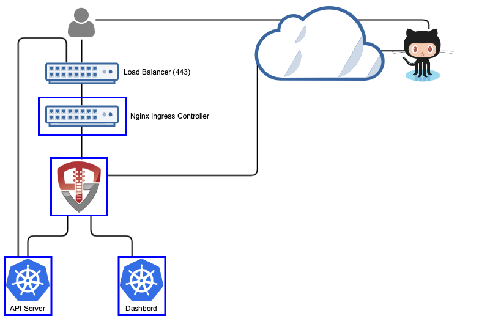

# Orchestra Login Portal for GitHub

[](https://vimeo.com/297400302)

*Short video of logging into Kubernetes and using kubectl using GitHub*

Orchestra Login Portal provides a login portal for Kubernetes that allows you to authenticate with GitHub, use GitHub teams and organizations for RBAC authorizations and provides integration for both `kubectl` and the Kubernetes Dashboard (https://github.com/kubernetes/dashboard).  The portal runs inside of Kubernetes, leveraging Kubernetes for scalability, secret management and deployment. 



When a user accesses Kubernetes using Orchestra, they'll access both the login portal and the dashboard through OpenUnison (instead of directly via an ingress).  OpenUnison will inject the user's identity into each request, allowing the dashboard to act on their behalf.  The login portal has no external dependencies outside of GitHub and Kubernetes.  All objects for session state are stored as CRDs.

# Deployment

## Watch a Video

This 11 minute video shows the entire deployment and user onboarding process

[](https://vimeo.com/297399119)

## What You Need To Start

Prior to deploying Orchestra you will need:

1. Kubernetes 1.10 or higher
2. The Nginx Ingress Controller deployed (https://kubernetes.github.io/ingress-nginx/deploy/)
3. Client id and secret from a GitHub OAuth2 Application
4. Deploy the dashboard to your cluster 

This installer will create the `openunison` namespace, create certificates for you (including for the dashboard) and the appropriate `CronJob` needed to make sure that certificates are kept updated.

## Prepare Deployment

Orchestra is driven by a Kubernetes Custom Resource that stores configuration properties.  Secret properties are stored in a source secret.  The deployment tool will create the correct objects for you.  You'll need to create two properties files, one for secret information (such as passwords) and one for non-secret data.  First create a directory for non secret data, ie `/path/to/orchestra-configmaps` and create a file called `input.props` with the below content customized for your environment:


```properties
OU_HOST=k8sou.tremolo.lan
K8S_DASHBOARD_HOST=k8sdb.tremolo.lan
K8S_URL=https://k8s-installer-master.tremolo.lan:6443
OU_CERT_OU=k8s
OU_CERT_O=Tremolo Security
OU_CERT_L=Alexandria
OU_CERT_ST=Virginia
OU_CERT_C=US
USE_K8S_CM=true
SESSION_INACTIVITY_TIMEOUT_SECONDS=900
MYVD_CONFIG_PATH=WEB-INF/myvd.conf
GITHUB_CLIENT_ID=XXXXXXXXXXXXXX
GITHUB_TEAMS=MyOrg/
```

Also, place any certificates you want Orchestra to trust in PEM format in `/path/to/orchestra-configmaps`.  Any certificates stored as PEM files will be trusted by Orchestra.

Next create a directory for secret information, such as `/path/to/orchestra-secrets` with a file called `input.props` with at least the below information:


```properties
GITHUB_SECRET_ID=XXXXXXXXXXXXXXXXXXXXXXXXXXXXXXXXXXXXX
unisonKeystorePassword=start123
```

*Detailed Description of Non-Secret Properties*

| Property | Description |
| -------- | ----------- |
| OU_HOST  | The host name for OpenUnison.  This is what user's will put into their browser to login to Kubernetes |
| K8S_DASHBOARD_HOST | The host name for the dashboard.  This is what users will put into the browser to access to the dashboard. **NOTE:** `OU_HOST` and `K8S_DASHBOARD_HOST` **MUST** share the same DNS suffix. Both `OU_HOST` and `K8S_DASHBOARD_HOST` **MUST** point to OpenUnison |
| GITHUB_CLIENT_ID | The client id from your GitHub OAuth2 application |
| GITHUB_TEAMS | A comma separated list of authorized teams and organizations.  An organization is listed in the format `OrgName/` and a team in the formate `OrgName/TeamName` |
| K8S_URL | The URL for the Kubernetes API server | 
| OU_CERT_OU | The `OU` attribute for the forward facing certificate |
| OU_CERT_O | The `O` attribute for the forward facing certificate |
| OU_CERT_L | The `L` attribute for the forward facing certificate |
| OU_CERT_ST | The `ST` attribute for the forward facing certificate |
| OU_CERT_C | The `C` attribute for the forward facing certificate |
| USE_K8S_CM | Tells the deployment system if you should use k8s' built in certificate manager.  If your distribution doesn't support this (such as Canonical and Rancher), set this to false |
| SESSION_INACTIVITY_TIMEOUT_SECONDS | The number of seconds of inactivity before the session is terminated, also the length of the refresh token's session |
| MYVD_CONFIG_PATH | The path to the MyVD configuration file, unless being customized, use `WEB-INF/myvd.conf` |
| K8S_DASHBOARD_NAMESPACE | **Optional** If specified, the namespace for the dashboard.  For the 1.x dashboard this is `kube-system`, for the 2.x dashboard this is `kubernetes-dashboard` |
| K8S_CLUSTER_NAME | **Optional** If specified, the name of the cluster to use in the `./kube-config`.  Defaults to `kubernetes` |

*Detailed Description of Secret Properties*

| Property | Description |
| -------- | ----------- |
| GITHUB_SECRET_ID | The secret from your GitHub OAuth2 application |
| unisonKeystorePassword | The password for OpenUnison's keystore |


## Deployment

Based on where you put the files from `Prepare Deployment`, run the following:

```
curl https://raw.githubusercontent.com/TremoloSecurity/kubernetes-artifact-deployment/master/src/main/bash/deploy_openunison.sh | bash -s /path/to/orchestra-configmaps /path/to/orchestra-secrets https://raw.githubusercontent.com/OpenUnison/openunison-k8s-login-github/master/src/main/yaml/artifact-deployment.yaml
```

The output will look like:

```
namespace/openunison-deploy created
configmap/extracerts created
secret/input created
clusterrolebinding.rbac.authorization.k8s.io/artifact-deployment created
job.batch/artifact-deployment created
NAME                        READY     STATUS    RESTARTS   AGE
artifact-deployment-jzmnr   0/1       Pending   0          0s
artifact-deployment-jzmnr   0/1       Pending   0         0s
artifact-deployment-jzmnr   0/1       ContainerCreating   0         0s
artifact-deployment-jzmnr   1/1       Running   0         4s
artifact-deployment-jzmnr   0/1       Completed   0         15s
```

Once you see `Completed`, you can exit the script (`Ctl+C`).  This script will import the OpenUnison operator, create the appropriate Custom Resource Definitions and finally deploy a custom resource based on your configuration.  Once the custom resource is deployed the OpenUnison operator will deploy Orchestra for you.

## Using Your Own Certificate for TLS

The operator deploys a self signed certificate for use by the ingress when accessing OpenUnison and the Kubernetes Dashboard.  In order to use your own certificate, replace the `ou-tls-certificate` TLS secret in the `openunison` namespace with your own certificate and private key.  ***NOTE:***  this certificate has entries for both the dashboard and Orchestra so any certificate will need to be able to handle both URLs.

## Complete SSO Integration with Kubernetes

Run `kubectl describe configmap api-server-config -n openunison` to get the SSO integration artifacts.  The output will give you both the API server flags that need to be configured on your API servers.  The certificate that needs to be trusted is in the `ou-tls-certificate` secret in the `openunison` namespace.

## First Login

To login, open your browser and go to the host you specified for `OU_HOST` in your `input.props`.  For instance if `OU_HOST` is `k8sou.tremolo.lan` then navigate to https://k8sou.tremolo.lan.  You'll be prompted for your Active Directory username and password.  Once authenticated you'll be able login to the portal and generate your `.kube/config` from the Tokens screen.

## Authorizing Access via RBAC

On first login, if you haven't authorized access to any Kubernetes roles you won't be able to do anything.  There are two approaches you can take:

### Organization / Team Driven Membership

Kubernetes will see your user's organizations and teams as groups.  To authorize users based on these groups, list them in your RBAC policies as groups with organizations being in the format `OrgName/` and teams being the format `OrgName/TeamName`.   To authorize members of team `TremnoloSecurity/Ownsers` to be cluster administrators, we create a `ClusterRoleBinding`:

```
kind: ClusterRoleBinding
apiVersion: rbac.authorization.k8s.io/v1
metadata:
  name: github-cluster-admins
subjects:
- kind: Group
  name: TremoloSecurity/Owners
roleRef:
  kind: ClusterRole
  name: cluster-admin
  apiGroup: rbac.authorization.k8s.io
```

### User Driven Membership

If you are not able to use teams or organizations in GitHub, you can directly add users to role bindings.  Kubernetes requires that you identify openid connect users with the prefix of the url of the identity provider.  So if your `OU_HOST` is `k8sou.tremolo.lan` and your user's login is `mmosley` your username to Kubernetes would be `https://k8sou.tremolo.lan/auth/idp/k8sIdp#mmosley`.  To create a cluster role binding to give cluster-admin access to a specific user:

```
kind: ClusterRoleBinding
apiVersion: rbac.authorization.k8s.io/v1
metadata:
  name: github-cluster-admins
subjects:
- kind: User
  name: https://k8sou.tremolo.lan/auth/idp/k8sIdp#mmosley
roleRef:
  kind: ClusterRole
  name: cluster-admin
  apiGroup: rbac.authorization.k8s.io
```

*NOTE*: There are multiple reasons this is a bad idea:
1.  Hard to audit - There is no easy way to say "what role bindings is `mmosley` a member of?
2.  Difficult to remove access - Same reason as #1, you need to figure out every role binding a user is a member of to remove
3.  Easy to get wrong - If you mistype a user's login id Kubernetes won't tell you

If you can't use Active Directory groups, take a look at the OpenUnison Identity Manager for Kubernetes - https://github.com/TremoloSecurity/openunison-qs-kubernetes/tree/activedirectory.  This tool adds on to the login capabilities with the ability to manage access to the cluster and namespaces, along with providing a self service way for users to request new namespaces and manage access.

# Whats next?

Now you can begin mapping OpenUnison's capabilities to your business and compliance needs.  For instance you can add multi-factor authentication with TOTP or U2F, Create privileged workflows for onboarding, scheduled workflows that will deprovision users, etc.

# Updating Secrets and Certificates

To update any of the secrets in the source secret:

1. Update the `orchestra-secrets-source` secret in the `openunison` namespace as appropriate
2. Add an annotation (or edit an existing one) on the `orchestra` `openunison` object in the `openunison` namespace

This will trigger the operator to update your OpenUnison pods.  To update certificates or non-secret data, just update it in the `orchestra` `openunison` object.

# Customizing Orchestra

Orchestra is an application built on OpenUnison with several "opinions" on how you should manage authentication in your cluster.  These opinions my be close to what you need, but not exact.  In order to customize Orchestra you'll need:

1. git
2. OpenJDK 8
3. Apache Maven
4. Docker registry

First, fork this GitHub project.  Then make your edits.  To deploy to a local Docker daemon that you want to then use to push to a registry:

```
mvn clean package
mvn compile jib:dockerBuild
docker tag image:version registry/image:version
docker push registry/image:version
```

If you have credentials to access a registry remotely and are not running docker locally, you can push the image directly to your registry:

```
mvn clean package
export OU_CONTAINER_DEST=registry/image:version
export OU_REG_USER=registry_user
export OU_REG_PASSWORD=registry_password
mvn compile jib:build
```